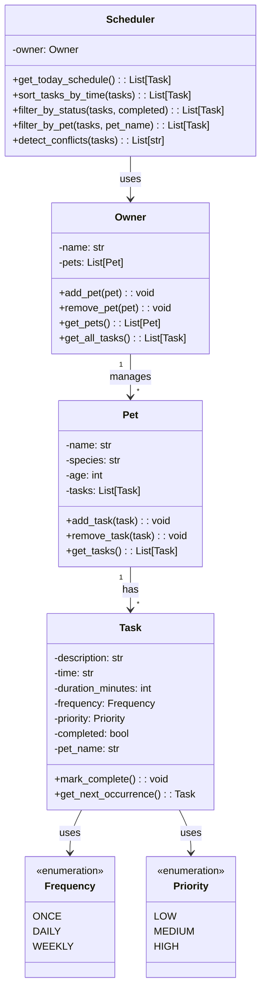

**Key Relationships:**
- **Owner → Pet** (1 to many): An owner can have multiple pets
- **Pet → Task** (1 to many): Each pet can have multiple tasks
- **Scheduler → Owner**: The scheduler accesses pets and tasks through the owner
- **Task uses Frequency & Priority**: Enums that define task attributes

